# Clinexa V1 Happy Path Flow

```mermaid
flowchart TD
  S0([Start Clinexa V1 Happy Path]) --> U1[Patient Register or Login<br/>Auth Sprint 1]
  U1 --> P1[Create Patient Profile<br/>Patients Sprint 3]
  P1 --> B1[Book Appointment<br/>Appointments Sprint 4]
  B1 --> AUTO[Auto Assign Doctor<br/>Single doctor V1]
  AUTO --> Apend[(Appointment Created<br/>Status pending)]

  Apend --> N1[Email Trigger<br/>Appointment Created]
  N1 --> ED[Email Sent to Doctor<br/>Sprint 7]

  ED --> D1[Doctor Login<br/>Auth Sprint 1]
  D1 --> D2[Doctor Profile and Clinic Ready<br/>Sprint 2]
  D2 --> L1[Doctor Views Appointments<br/>Appointments Sprint 4]
  L1 --> C1[Doctor Confirms Appointment<br/>PATCH confirm]
  C1 --> Aconf[(Appointment Status confirmed)]

  Aconf --> N2[Email Trigger<br/>Appointment Confirmed]
  N2 --> EP1[Email Sent to Patient<br/>Sprint 7]

  EP1 --> V1[Patient Views Confirmed Appointment<br/>GET my appointments]
  V1 --> VISIT([Clinic Visit Happens])

  VISIT --> RX1[Doctor Creates Prescription<br/>Prescriptions Sprint 5]
  RX1 --> RX[(Prescription Saved)]
  RX --> Pview[Patient Views Prescription<br/>GET prescriptions my]

  Pview --> DONE([Happy Path Completed ✅])
```

## Sprint Breakdown

- **Sprint 1**: Authentication (Register/Login for Patient & Doctor)
- **Sprint 2**: Doctor Profile & Clinic Setup
- **Sprint 3**: Patient Profile
- **Sprint 4**: Appointments (Create, View, Confirm)
- **Sprint 5**: Prescriptions
- **Sprint 7**: Email Notifications

## Key Appointment States

1. `pending` - Appointment created, awaiting doctor confirmation
2. `confirmed` - Doctor has confirmed the appointment
3. `completed` - Visit finished, prescription created
